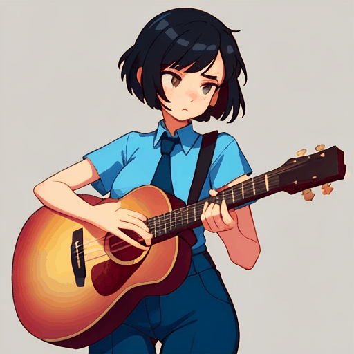

# SmoothAnyStyle

---

A repo for smoothening any two personalized T2I Diffusion models. It's a plugin-to-play module producing fancy GIFs with continuous style injection and motion.

## 🚧 TODO List

- [ ] Add Gallery
- [ ] Release Code
- [ ] Release Pretrained Model

---

## Gallery

<table class="center">
    <tr>
    <td></td>
    <td></td>
    <td></td>
    <td></td>
    </tr>
</table>

<table class="center">
    <tr>
    <td></td>
    <td></td>
    <td></td>
    <td></td>
    </tr>
</table>

<table class="center">
    <tr>
    <td></td>
    <td></td>
    <td></td>
    <td></td>
    </tr>
</table>

---
